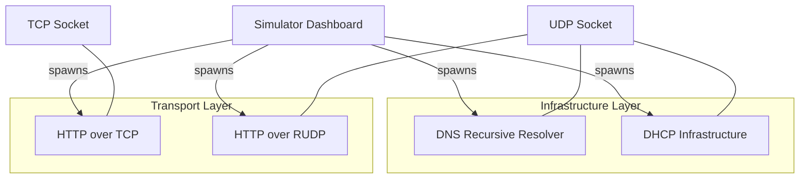

# Network Protocol Simulator & Analysis Tool


A high-performance, multithreaded networking laboratory implementing core OSI-model protocols from the ground up using low-level socket programming. This project demonstrates deep systems engineering principles, featuring infrastructure services (DNS, DHCP) and transport layer innovations (Reliable UDP).

---

## 🏗 System Architecture

The simulator follows a modular architecture where each protocol is implemented as an independent server extending a common `BaseServer` lifecycle.



---

## 🚀 Key Features

### 1. Reliable UDP (RUDP) Interface
Unlike standard UDP, our custom RUDP implementation ensures 100% data integrity over lossy channels using:
- **Stop-and-Wait ARQ**: Positive acknowledgments for Every chunk.
- **Exponential Backoff**: Intelligent retransmission timeouts (1s to 8s).
- **Packet Serialization**: custom binary headers with sequence tracking and flags.

### 2. DNS Recursive Resolver
A professional-grade DNS service featuring:
- **Thread-safe Caching**: Atomic record management.
- **Upstream Recursion**: Failover to public resolvers via `dnspython`.
- **Dynamic Updates**: Secondary listener for live cache injection.

### 3. DHCP Infrastructure
Simulates the critical network provisioning cycle:
- **DORA Machine**: Complete Discover, Offer, Request, Ack state machine.
- **Pool Management**: Automated CIDR-aware IP allocation.
- **MAC-to-IP Binding**: Persistent lease tracking.

### 4. HTTP over TCP
Standardized file transfer implementation serving as a control group for protocol performance analysis.

---

## 🚦 Getting Started

### Installation

```bash
# Clone the repository
git clone https://github.com/GalHillel/Network-Protocol-Simulator.git
cd Network-Protocol-Simulator

# Install pinned dependencies
pip install -r requirements.txt
```

### Running the Dashboard

The primary entry point is the `network_simulator.py` GUI, which orchestrates all services:

```bash
python network_simulator.py
```

### Protocol Demos

Standalone scripts for headless protocol testing are located in `examples/`:

```bash
# Test RUDP reliability
python examples/run_rudp_demo.py

# Test DNS resolution
python examples/run_dns_demo.py
```

---

## 🧪 Automated Testing

The project includes a comprehensive suite of 46+ tests covering protocol mechanics, stress scenarios, and network simulation.

```bash
pytest -v
```

---

## 📘 Documentation

- [**Architecture Overview**](docs/architecture.md) - Design patterns and class hierarchies.
- [**Protocol Specifications**](docs/protocols.md) - Wire format and state machine details.
- [**RUDP Design Deep-Dive**](docs/rudp-design.md) - Retransmission logic and overhead analysis.
- [**Traffic Inspection**](docs/wireshark-analysis.md) - Wireshark pcap analysis guidelines.

---
*Developed by Gal Hillel — Senior Software Engineer specializing in Systems & Infrastructure.*
