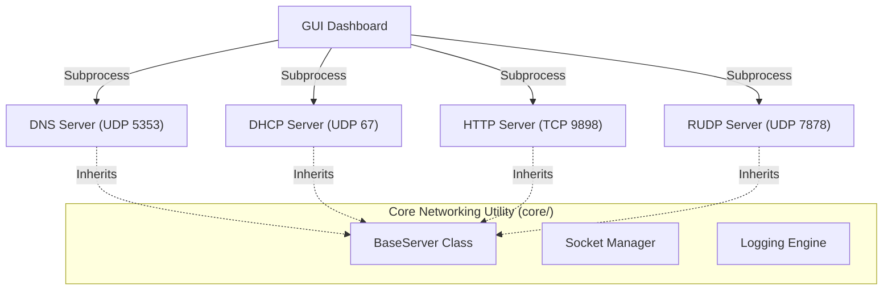

# System Architecture & Networking Model

The Network Protocol Simulator is a distributed, multithreaded environment designed to showcase professional implementation of core internet protocols. It transitions from traditional synchronous socket patterns to modern, event-driven management.

---

## 🏛 Component Hierarchy

The system is organized into three distinct layers:

1.  **Orchestration Layer**: The `network_simulator.py` GUI and `SimulationManager` handle process lifecycle, subprocess spawning, and graceful teardown.
2.  **Infrastructure Layer**: DNS and DHCP services providing the foundation for network addressability (IP allocation) and name resolution.
3.  **Application/Transport Layer**: HTTP services implemented over both standard TCP (stream-based) and custom RUDP (packet-based reliability).

---

## 🛠 Shared Infrastructure (`core/`)

To ensure "Don't Repeat Yourself" (DRY) principles, critical logic is abstracted into the `core/` package:

### 1. `BaseServer` Abstraction
All protocol servers inherit from `BaseServer`. It provides a standardized lifecycle:
-   `start()`: Spawns the main serve loop in a background thread.
-   `shutdown()`: Orchestrates safe socket closure and thread joining (Event-based).
-   `_serve_forever()`: An abstract hook where specific protocol logic is implemented.

### 2. `SocketManager`
Handles low-level socket operations with robust error checking, specifically addressing common socket failures like `WinError 10038` and ensuring safe multi-threaded access to raw descriptors.

### 3. `LoggingConfig`
Centralized structured logging using Python's `logging` module. Replaces `print` statements with level-filtered, timestamped logs for professional observability.

---

## 🧵 Concurrency Model

The simulator utilizes a **One-Thread-Per-Connection** (or listener) model:

-   **Parallel Listeners**: The DNS server runs two independent UDP listener threads (Query and Administrative Update) using shared thread-safe caches.
-   **Dynamic Workers**: The HTTP and RUDP servers spawn transient worker threads for individual file transfers, preventing a single slow download from blocking subsequent protocol handshakes.
-   **Thread Safety**: Mutual Exclusion (Locks) are used in the DHCP IP pool and DNS cache to prevent race conditions during concurrent allocations.

---

## 🛡 Fault Tolerance & Reliability

-   **Process Isolation**: Each protocol runs in its own process. A logic error in the custom RUDP handler cannot corrupt the memory space of the DNS or DHCP services.
-   **Graceful Degradation**: If broadcast traffic is blocked (common on some OS environments), the DHCP server automatically falls back to unicast/localhost signaling to ensure simulation continuity.
-   **Resource Cleanup**: Finalizers and `atexit` handlers ensure that no dangling sockets or orphan processes remain after the dashboard is closed.
